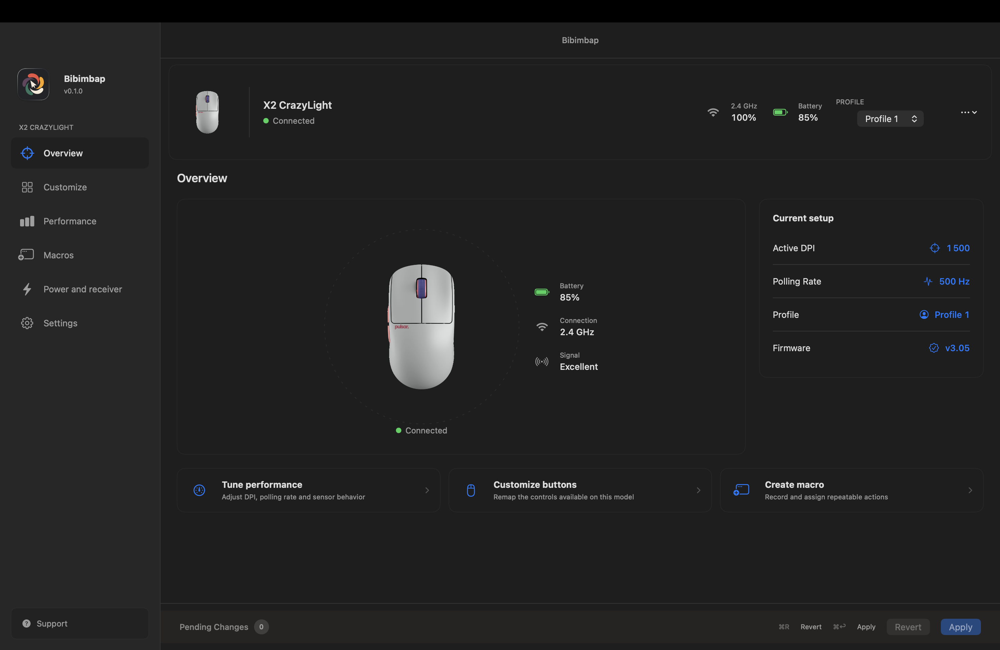
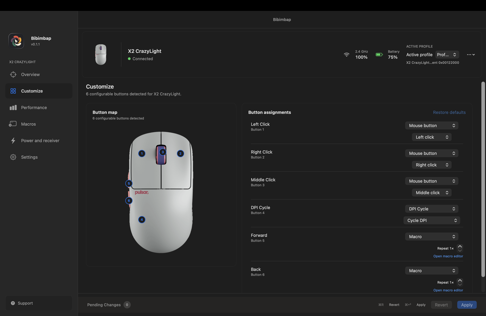
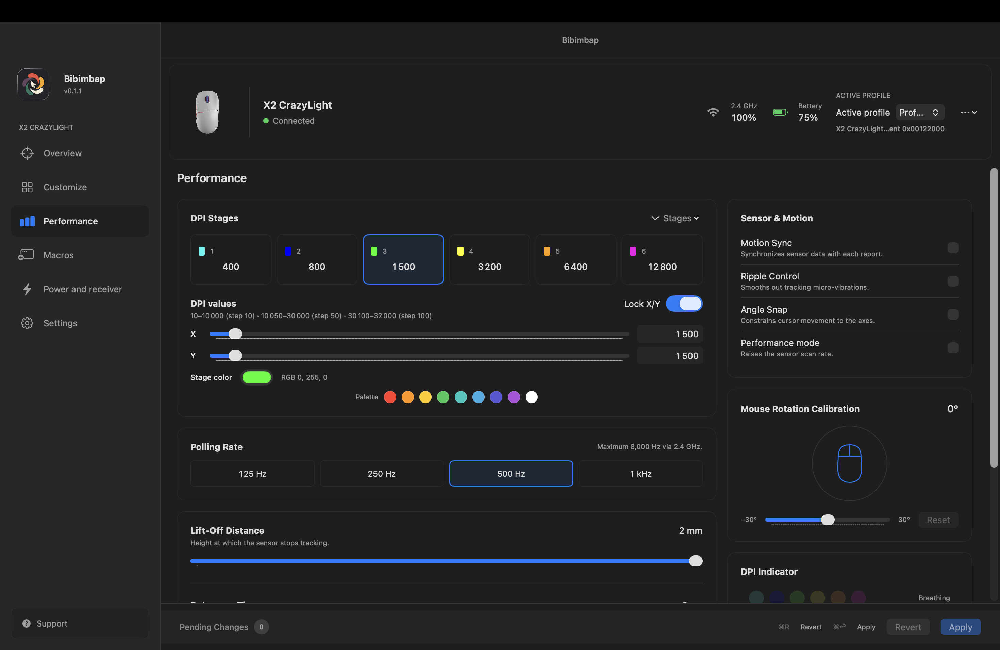
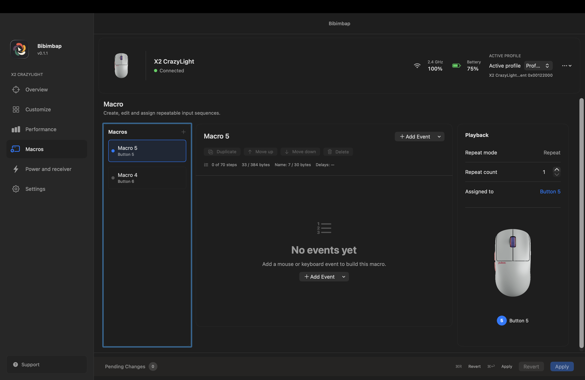
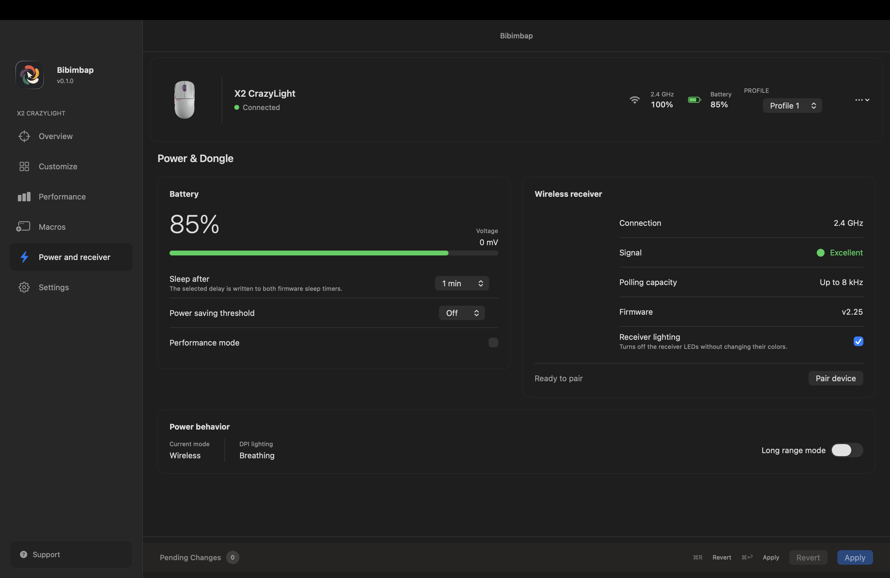
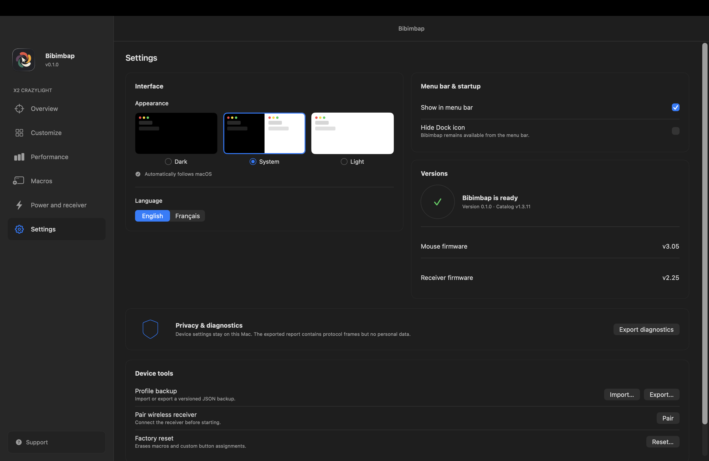

<div align="center">
  
  <h1>Bibimbap</h1>
  <p>Configure a supported Pulsar mouse from macOS.</p>
  <p>
    <a href="https://github.com/amassias/Bibimbap/actions/workflows/swift.yml"></a>
    
    
  </p>
</div>

---

Bibimbap is a native macOS app for supported Pulsar mice. It reads the device state through `IOHIDManager`, shows the controls available for the connected model, and writes changes back to the mouse or receiver.

The app does not use a browser bridge, WebHID, or a background web service. Device settings stay on the Mac.

> [!NOTE]
> Bibimbap is an independent project. It is not affiliated with, endorsed by, or maintained by Pulsar Gaming Gears. The protocol notes are in [`docs/protocol.md`](docs/protocol.md).

## Quick start

### Install the app

Download the latest `.dmg` file from [GitHub Releases](https://github.com/amassias/Bibimbap/releases/latest). The verification steps are in the [download guide](docs/download.md).

1. Open `Bibimbap-<version>.dmg`.
2. Drag `Bibimbap.app` into the `Applications` folder shown in the window.
3. Open Bibimbap from `Applications`.

The DMG contains the application and nothing else is required to run it.

The current packaged build is published on the [Bibimbap 0.1.1 release page](https://github.com/amassias/Bibimbap/releases/tag/v0.1.1), with a versioned DMG, ZIP, manifest, and SHA-256 checksums.

> [!NOTE]
> Free builds are not notarized. If macOS blocks the first launch, Control-click Bibimbap, choose **Open**, and confirm once. Only use builds downloaded from the official release page.

### Build from source

```bash
xcodebuild \
  -project App/Bibimbap.xcodeproj \
  -scheme Bibimbap \
  -configuration Debug \
  build
```

## Recent changes

<details>
<summary>Open the current feature list</summary>

- The Overview page shows the connection, battery, signal, firmware, DPI, polling rate, and active profile.
- The interface follows Light, Dark, or System appearance settings.
- Button assignments and macros use the capabilities reported by the connected model.
- Macro editing includes validation, repeat modes, and hardware-slot assignment.
- Power and receiver settings include battery behavior, receiver lighting, and pairing.
- Settings includes English and French UI selection, profile backup, and diagnostics export.

</details>

## Screenshots

These screenshots show the current application with a connected X2 CrazyLight.

<table>
  <tr>
    <td width="50%"></td>
    <td width="50%"></td>
  </tr>
  <tr>
    <td width="50%"></td>
    <td width="50%"></td>
  </tr>
  <tr>
    <td width="50%"></td>
    <td width="50%"></td>
  </tr>
</table>

## Table of contents

- [Features](#features)
- [How it works](#how-it-works)
- [Supported hardware](#supported-hardware)
- [Installation](#installation)
- [Usage](#usage)
- [Safety and privacy](#safety-and-privacy)
- [Project status](#project-status)
- [Troubleshooting](#troubleshooting)
- [Development](#development)
- [Localization](#localization)
- [Limitations](#limitations)
- [Contributing](#contributing)
- [License](#license)

## Features

- Native SwiftUI interface for macOS.
- Overview page with the current device state.
- DPI stages, polling rate, lift-off distance, debounce, sensor options, and DPI lighting.
- Button remapping for mouse actions, DPI cycling, macros, and other supported functions.
- Macro creation, editing, validation, repeat behavior, and hardware-slot assignment.
- Wireless receiver status, pairing, battery behavior, receiver lighting, and power settings.
- Versioned JSON profile backup and import.
- Local diagnostics export with protocol frames and no personal data.
- Device catalog with 31 families, 127 model identifiers, and matching artwork.

## How it works

Bibimbap uses the connected device as the source of truth.

1. It discovers the mouse or receiver through macOS HID services.
2. It reads the device state and identifies the model capabilities.
3. It displays the settings available for that model.
4. It keeps edits in a local pending state until you choose **Apply**.
5. It writes the required protocol frames.
6. It reads the state back and reports a mismatch instead of hiding it.

## Supported hardware

- **Operating system:** macOS 15 or later
- **Supported Macs:** Apple silicon
- **Hardware scope:** Pulsar model identifiers included in `PulsarCatalog`
- **Catalog snapshot:** v1.3.11
- **Physical validation:** X2 CrazyLight over USB and through an 8K receiver

The catalog covers more models than the current hardware tests. The X2 CrazyLight is the device used for the full hardware validation described in [`docs/protocol.md`](docs/protocol.md). The evidence levels and known limits are listed in the [validation matrix](docs/validation-matrix.md).

## Installation

### From a DMG

Each release is distributed as a disk image:

```text
Bibimbap-0.1.1-arm64.dmg
└── Bibimbap.app
```

Open the DMG, drag the app to `Applications`, eject the mounted disk, and launch the app from its installed location.

### Build locally

You need macOS 15 or later, Xcode with the macOS 15 SDK, and a supported Pulsar mouse or receiver for hardware features.

```bash
xcodebuild \
  -project App/Bibimbap.xcodeproj \
  -scheme Bibimbap \
  -configuration Debug \
  build
```

## Usage

1. Connect a supported Pulsar mouse or receiver.
2. Launch Bibimbap and select the detected device.
3. Check the current state in **Overview**.
4. Change settings in **Customize**, **Performance**, **Macros**, or **Power and receiver**.
5. Review the pending changes and choose **Apply**.

For a read-only hardware report:

```bash
swift run pulsar-probe
```

To run the app with a simulated X2 CrazyLight:

```bash
BIBIMBAP_SIMULATED=1 \
  /path/to/Bibimbap.app/Contents/MacOS/Bibimbap
```

## Safety and privacy

- Every write is followed by an independent read-back.
- A failed read-back stops the operation and rolls the batch back in reverse order.
- Bibimbap reports when a rollback cannot be confirmed.
- Unsupported controls are left out of the interface.
- Unknown models are rejected instead of using guessed addresses or limits.
- Imported profiles only fill a pending draft. Unsupported values are skipped and reported.
- Device settings stay on the Mac.
- The bundled catalog is not downloaded or executed at runtime.

## Project status

| Area | Status |
|---|---|
| HID transport | Validated over USB and through an 8K receiver |
| Protocol | Reads and writes validated on hardware |
| Device catalog | 31 families and 127 models from snapshot v1.3.11 |
| Simulator | Normal paths and injected failures covered |
| Application | Configuration UI, pairing, backups, diagnostics, and localization |
| Macros | Read, write, edit, validation, and simulator round trips |
| Firmware updates | Not implemented; update commands are rejected |

## Troubleshooting

### The device does not appear

Reconnect the mouse or receiver, then relaunch Bibimbap. If the device still does not appear, run the read-only probe and attach its output to an issue.

### A write fails

Bibimbap stops the operation and checks the device state. Export diagnostics before opening an issue.

### A setting is missing

The connected model may not support that setting. Check the model and firmware shown in **Overview**.

### Run diagnostics

```bash
swift run pulsar-probe
```

The probe does not write to the device. Reversible hardware checks are available separately:

```bash
swift run pulsar-writetest
```

## Development

Build and test the Swift package:

```bash
swift build
swift test
```

Regenerate the device catalog:

```bash
python3 Tools/generate_catalog.py
```

Compare the bundled catalog with the published upstream snapshot:

```bash
BIBIMBAP_CHECK_CATALOG=1 swift test --filter CatalogSnapshotTests
```

## Localization

English is the source and fallback language. French is available from **Settings** and can be switched without reconnecting the mouse.

The string catalog is stored in:

```text
App/Bibimbap/Localizable.xcstrings
```

## Limitations

- Bibimbap requires macOS 15 or later on an Apple silicon Mac.
- Support is limited to Pulsar model identifiers in the bundled catalog. The catalog is a declaration layer, not a compatibility guarantee for every firmware revision or physical unit; unknown models are rejected rather than guessed.
- Controls vary by model, firmware, connection type, and reported capabilities. Unsupported settings are omitted from the interface instead of being written speculatively.
- Physical validation is strongest for the Pulsar X2 CrazyLight, firmware `v3.05`, over USB and through an 8K receiver. Other catalog models, firmware revisions, receivers, and sensors are not necessarily physically validated.
- Wireless polling above 1 kHz, sleep/wake, reconnect, and multi-device selection remain outside the current physical validation matrix.
- Firmware updates are not implemented. Bibimbap only reads and writes supported configuration settings.
- Free or locally generated packages may be unsigned and not notarized. The first launch can therefore require the documented **Open** confirmation in macOS; the release manifest records the actual signing and notarization state.

## Contributing

Contributions are welcome through issues and pull requests.

For hardware-related changes, include the exact mouse or receiver model, firmware version, connection type, macOS version, and whether the observation comes from physical hardware, a simulator, or a retained fixture. Keep protocol changes paired with focused tests and independent read-back or rollback evidence where applicable. Do not include private HID captures, credentials, or unrelated personal data.

## License

No open-source license is currently included in this repository. Until a license is added, the source remains protected by applicable copyright law; publishing it on GitHub does not by itself grant permission to reuse, modify, or redistribute it.
